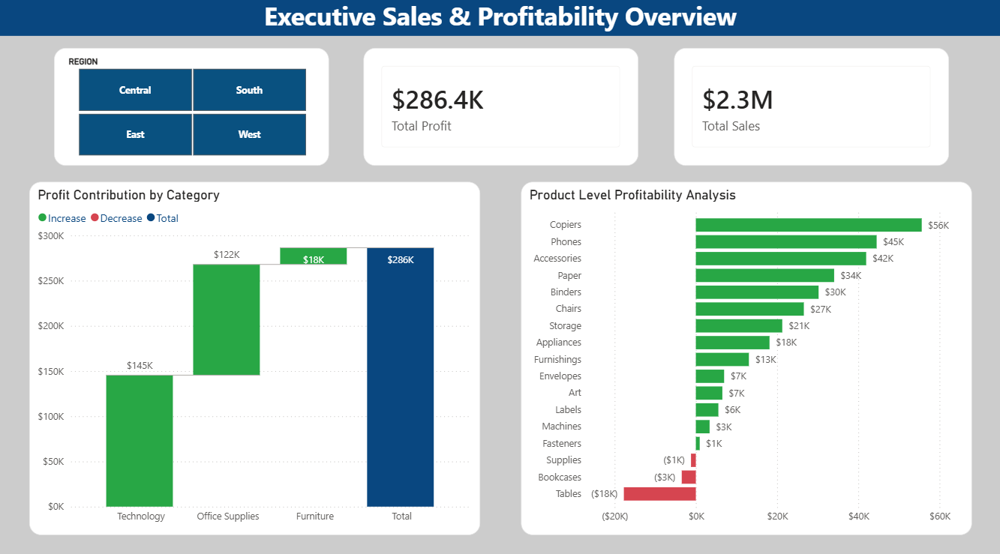

Executive Sales & Profitability Analysis 📊
Project Overview
This is an end-to-end data analytics project designed to identify profitability trends and operational growth opportunities for a retail business. The workflow involves raw data processing with PostgreSQL, KPI calculation, and the development of a high-fidelity Power BI Executive Dashboard for strategic decision-making.

Repository Structure
/data: Contains the raw datasets used for the analysis.

/sql_queries: SQL scripts for data cleaning, transformation, and KPI validation.

/reports: Power BI project file (.pbix) and high-resolution dashboard exports.

Key Business Insights
The dashboard reveals critical performance metrics and operational risks:

Overall Performance: Achieved $2.3M in total sales with a net profit of $286.4K, maintaining a healthy 12.4% profit margin.

Profitability Leakage: The Tables category represents a significant risk, with a net loss of -$18K, indicating a need to re-evaluate pricing or logistics strategies.

Primary Growth Drivers: Copiers ($56K profit) and Phones ($45K profit) are the leading contributors to the bottom line.

Category Contribution: Waterfall analysis confirms that the Technology sector provides the highest margin, while Furniture significantly suppresses overall profitability.

Technical Features
Executive UI/UX: Applied Flat Design principles with a corporate color palette (#124578, #28A745, #D64550) for maximum clarity and professional appeal.

Advanced Visualizations: Utilized Waterfall charts for cumulative profit analysis and Pareto-style bar charts for product-level profitability.

Interactive Slicers: Enabled real-time regional filtering (Central, East, South, West) to allow for granular performance tracking.

Tech Stack
Database: PostgreSQL (Data Transformation & Aggregation)

Visualization: Power BI (Reporting & UI Design)

Methodology: Descriptive & Diagnostic Analytics

---

## 💡 Strategic Recommendations
Based on the data-driven insights from the dashboard, the following actions are recommended:

* **Urgent Intervention on Tables:** Investigate the high logistics costs and aggressive discount strategies associated with the **Tables** sub-category to stop the **-$18K** net loss.
* **Scale High-Margin Products:** Increase the marketing budget and inventory for **Copiers ($56K profit)** and **Phones ($45K profit)**, as they are the primary growth drivers of the business.
* **Regional Optimization:** Focus expansion efforts on the **West** region, which currently leads in both sales volume and profit margin stability.
* **Furniture Category Review:** Re-evaluate the pricing model for the entire **Furniture** segment to ensure that profitable items like **Chairs** are not being offset by underperforming sub-categories.